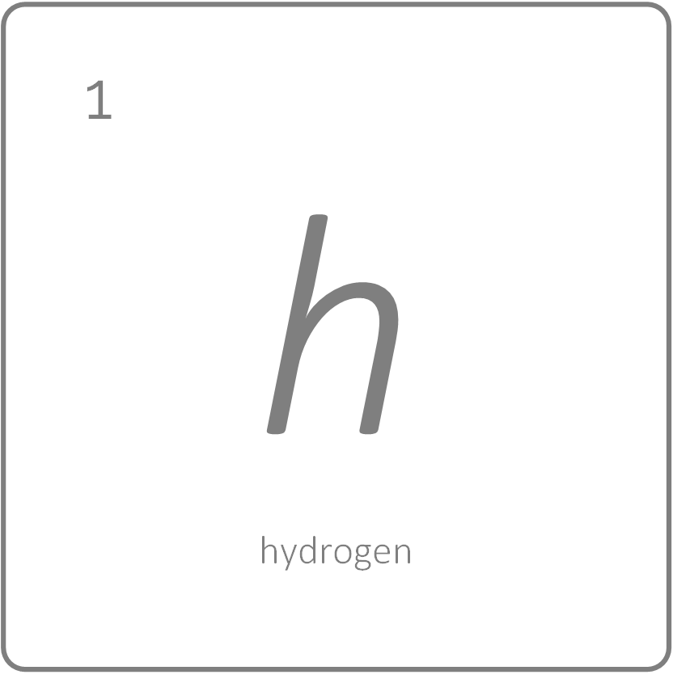

<h1 align='center'>hydrogen</h1>

<p align='center'>An interactive CLI tool for WSO2 Servers</p>

<br>

<br>

<p align="center">
  
</p>

<br>

<br>

[:construction: Work In Progress]

<br />

## Intro

A command line tool to alter and configure WSO2 servers for different requirements. The `hydrogen` supports to perform the following alterations and configurations ...

* Replace H2 datasources of `WSO2 API Manager` with other supported datasources

& many more.

Checkout for more on [**Hydrogen CLI WiKi**](https://github.com/athiththan11/hydrogen-CLI/wiki)

<br />

## Table of Contents

- [Intro](#intro)
- [Table of Contents](#table-of-contents)
- [Install &amp; Run](#install-amp-run)
  - [Dev Environment](#dev-environment)
  - [Troubleshoot](#troubleshoot)
- [Commands](#commands)
  - [Datasource](#datasource)
    - [Usage](#usage)
    - [datasource:apim](#datasourceapim)
    - [datasource:is](#datasourceis)
- [Examples](#examples)
  - [Datasource Examples](#datasource-examples)
- [License](#license)

<br />

## Install & Run

> Recommended to use `NodeJS v8.9` in your environment use the `hydrogen` flawlessly.

### Dev Environment

Clone or download the project and tool from [here](https://github.com/athiththan11/hydrogen-CLI). After successful clone process, execute the following command to install the dependencies from the root directory

```shell
npm install
```

And execute the following command to link the CLI tool with your local Node Modules libs

```shell
npm link
```

To verify, fire up a terminal and execute the following command

```shell
hydrogen --version
```

### Troubleshoot

If you encounter a similar error trace as following while running the tool, Please follow the given steps to solve it.

```shell
Error: /node_modules/libxmljs/build/xmljs.node: invalid ELF header
    at bindings (~/node_modules/bindings/bindings.js:84:48)
    at Object.<anonymous> (~/node_modules/libxmljs/lib/bindings.js:1:99)
```

* Check your locally installed Node version. If you have no Node installed or if you have any higher versions than v8.9, then install Node v8.9.0 using NVM (nvm helps to manage and run different node versions)
* Delete the `node_modules` folder from the `hydrogen` directory (extracted directory)
* Execute `npm install` from the root path of `hydrogen`

This will re-install all defined dependencies and builds to work with your environment as well as with `NodeJS v8.9.0` environment.

<br />

## Commands

Below listed are a couple of available commands and descriptions of `hydrogen CLI` tool.

> All altered configurations are commented with `HYDROGENERATED:` keyword. If you want to list all the applied alterations, open a configured node and search for the keyword `HYDROGENERATED:` to list all the altered configurations.

<br />

### Datasource

#### Usage

`Datasource` commands are used to alter and configure `master-datasource.xml` of WSO2 servers for the following use-cases

* Replace AM_DB H2 datasource with other supported datasources. For example: MySQL, Postgre, MSSQL etc.
* Configure AM, UM & REG datasources

You can list all available `datasource` commands by executing `hydrogen datasource --help`.

```shell
Alter datasource configurations of WSO2 Platforms with supported config models and database vendors

USAGE
  $ hydrogen  datasource [COMMAND]

DESCRIPTION
  ...
  Alter datasource configurations of WSO2 Platforms based on your requirements

  Use the following command to list all available 'Datasource' related commands
  $ hydrogen datasource --help

COMMANDS
  datasource:apim  Alter datasource configurations related WSO2 API Manager products with supported datasource config models
  datasource:is    Alter datasource configurations related WSO2 Identity Server products with supported datasource config models
```

#### datasource:apim

```shell
Alter datasource configurations related WSO2 API Manager products with supported datasource config models

USAGE
  $ hydrogen datasource:apim [FLAG] [ARG]

OPTIONS
  -c, --container                       create a docker container for the datasource
  -d, --datasource=mysql|postgre|mssql  (required) the type of datasource. refer to the supported options below
  -g, --generate                        create database and tables in the docker container
  -r, --replace                         replace AM_DB H2 datasource configurations
  -s, --setup                           configure AM, UM & REG datasources
  -v, --version=2.6                     (required) [default: 2.6] version of the WSO2 API Manager

DESCRIPTION
  ...
  Alter datasource configurations of WSO2 API Manager server based on your requirement

EXAMPLES
  Replace AM_DB H2 datasource with MySQL
  $ hydrogen datasource:apim --replace -v 2.6 --datasource mysql
  Replace AM_DB H2 datasource with MySQL and create Docker container for the datasource
  $ hydrogen datasource:apim --replace -v 2.6 --datasource mysql --container --generate
  Configure AM, UM & REG datasource with Postgre
  $ hydrogen datasource:apim --setup -v 2.6 --datasource postgre
  Configure AM, UM & REG datasources with Postgre and create Docker container for the datasources
  $ hydrogen datasource:apim --setup -v 2.6 --datasource postgre --container --generate
```

#### datasource:is

```shell
Alter datasource configurations related WSO2 Identity Server products with supported datasource config models

USAGE
  $ hydrogen datasource:is [FLAG] [ARG]

OPTIONS
  -c, --contianer                 create a docker container for the datasource
  -d, --datasource=mysql|postgre  (required) the type of datasource. refer to the supported options below
  -g, --generate                  create database and tables in the docker container
  -r, --replace                   replace Carbon H2 datasource configuration
  -v, --version=5.7               (required) [default: 5.7] version of the WSO2 Identity Server

DESCRIPTION
  ...
  Alter datasource configurations of WSO2 Identity Server based on your requirement

EXAMPLE
  Replace Carbon H2 datasource with MySQL
  $ hydrogen datasource:is --replace -v 5.7 --datasource mysql
```

<br />

## Examples

### Datasource Examples

* Need to configure `WSO2 API Manager v2.6` replacing the defualt shipped AM_DB H2 datasource with `Postgre`
  * Download and extract a fresh-pack of `WSO2 API Manager v2.6`
  * Fire up a terminal and navigate to the root directory of the extracted `WSO2 APIM` server
  * Execute the following

    ```shell
    # from root directory of wso2 apim
    hydrogen datasource:apim --replace -v 2.6 --datasource postgre
    ```

## License

Licensed under [MIT](https://github.com/athiththan11/hydrogen-CLI/blob/master/LICENSE).
